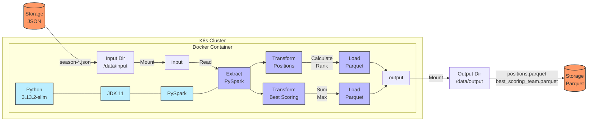
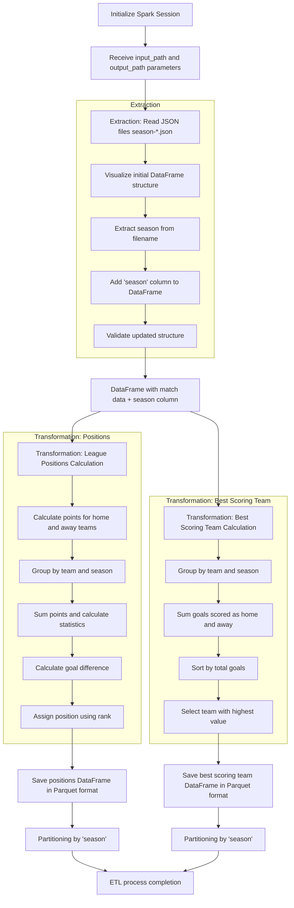

# **Premier League ETL**

##  **Project Description**
This project implements an **ETL pipeline** using **PySpark** to process Premier League match data stored in **JSON format**. The ETL extracts data, transforms it to calculate league positions and the best-scoring team per season, and stores the results in **Parquet format**.

The solution is containerized with **Docker** and designed to run on **Kubernetes** for scalability.

---

## **Architecture**

### **Premier League ETL Architecture**


---

##  **ETL Workflow**

### **Premier League ETL Workflow**


---

## 📖 **How to Deploy**

### **1 Prerequisites**
Ensure you have the following installed:
- **Docker** 
- **Kubernetes (kubectl & Minikube or a cluster)** 
- **Python 3.13.2** 

### **2 Build and Run with Docker**
#### **Build Docker Image:**
```bash
sudo docker build --no-cache -t etl_pyspark .
```

#### **Run Docker Container:**
```bash
sudo docker run --rm -v /home/user/data/input:/app/data/input \
                 -v /home/user/data/output:/app/data/output \
                 etl_pyspark
```

### **3 Deploy on Kubernetes**
#### **Create a Deployment (YAML):**
```yaml
apiVersion: apps/v1
kind: Deployment
metadata:
  name: etl-premier-league
spec:
  replicas: 1
  selector:
    matchLabels:
      app: etl-pyspark
  template:
    metadata:
      labels:
        app: etl-pyspark
    spec:
      containers:
      - name: etl-container
        image: etl_pyspark
        volumeMounts:
        - name: input-volume
          mountPath: /app/data/input
        - name: output-volume
          mountPath: /app/data/output
      volumes:
      - name: input-volume
        hostPath:
          path: /home/user/data/input
      - name: output-volume
        hostPath:
          path: /home/user/data/output
```

#### **Apply the Deployment:**
```bash
kubectl apply -f deployment.yaml
```

#### **Check Pod Status:**
```bash
kubectl get pods
```

#### **Check Logs:**
```bash
kubectl logs <POD_NAME>
```

### **4️⃣ Validate Output**
After execution, check the **output directory** for Parquet files:
```bash
ls /home/user/data/output
```
Expected output:
```
positions_0910.parquet  positions_1011.parquet  best_scoring_team.parquet
```

---

This ETL pipeline automates the processing of Premier League match data using **PySpark**. The **Docker + Kubernetes** integration makes the solution scalable and adaptable to production environments.


---

**Author:** Manuel Alejandro Bayona Leal  


---
